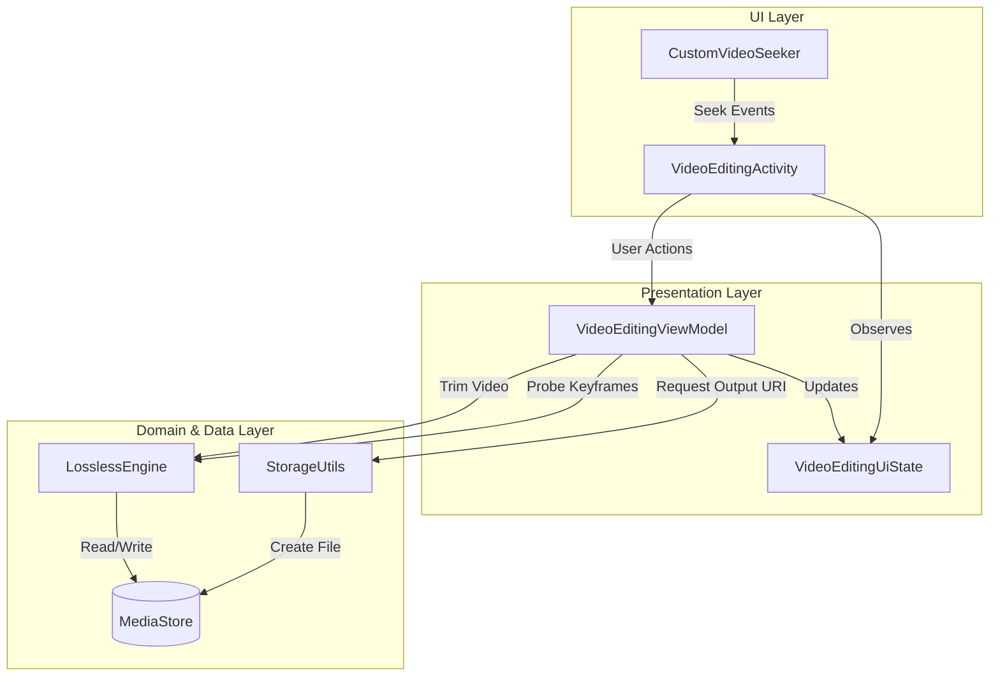
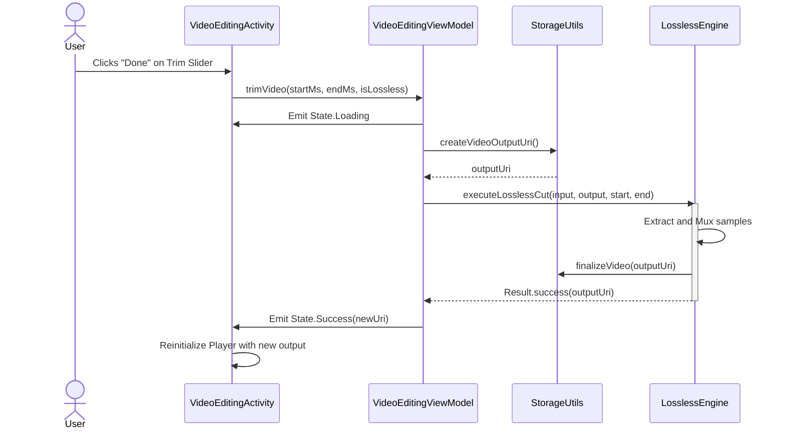

# Developer Guide & Knowledge Base (`AGENTS.md`)

## Project Overview
**Name**: Lossless Video Cut
**Package**: `com.tazztone.losslesscut`
**Tech Stack**: Kotlin, Android SDK (API 31+ target), Media3 (ExoPlayer), Lottie.

This project is a lightweight, open-source Android application designed for **lossless video trimming**. It avoids re-encoding the video stream, preserving original quality and ensuring near-instant processing speeds.

## Core Architecture (v2.0 MVVM)

### 1. High-Level Architecture
The application is structured into three primary layers to ensure a responsive UI, better testability, and a clean separation of concerns:
1. **UI Layer**: Responsbile for rendering the interface and capturing user inputs.
2. **Presentation Layer (ViewModel)**: Manages UI state, handles user intents, and coordinates with the Domain/Data layer.
3. **Domain/Data Layer (Engine & Storage)**: Encapsulates the core business logic (video processing) and handles file I/O operations via Scoped Storage.

### Component Diagram

### 2. Component Deep Dive

#### 2.1 UI Layer ([VideoEditingActivity.kt](app/src/main/java/com/tazztone/losslesscut/VideoEditingActivity.kt) & [CustomVideoSeeker.kt](app/src/main/java/com/tazztone/losslesscut/customviews/CustomVideoSeeker.kt))
- **VideoEditingActivity**: Initializes the ExoPlayer, binds UI components to the [ViewModel](app/src/main/java/com/tazztone/losslesscut/VideoEditingActivity.kt) state flow, and manages dialogs (like the BottomSheet for trimming).
- **CustomVideoSeeker**: A custom View that draws the timeline. It receives normalized keyframe positions from the Activity and draws "snap" markers. It implements logic to **snap the playhead to the nearest keyframe** when "Lossless Mode" is active.
- **State Observation**: The Activity observes [VideoEditingUiState](app/src/main/java/com/tazztone/losslesscut/VideoEditingViewModel.kt) via `lifecycleScope.launch`. State changes trigger UI updates like showing loading spinners, playing video, or displaying error toasts.

#### 2.2 Presentation Layer ([VideoEditingViewModel.kt](app/src/main/java/com/tazztone/losslesscut/VideoEditingViewModel.kt))
- **State Flow**: Uses a sealed class `VideoEditingUiState` (Initial, Loading, Success, Error) to represent the current screen state predictably.
- **Coroutines**: Launches non-blocking operations via `viewModelScope` allowing heavy video processing to happen on `Dispatchers.IO` without freezing the main thread.
- **Initialization**: Upon receiving a Video URI, it orchestrates metadata extraction and keyframe probing through the engine.

#### 2.3 Domain/Data Layer ([LosslessEngine.kt](app/src/main/java/com/tazztone/losslesscut/LosslessEngine.kt) & [StorageUtils.kt](app/src/main/java/com/tazztone/losslesscut/StorageUtils.kt))
- **LosslessEngine**: The core powerhouse. It completely drops FFmpeg in favor of native `MediaExtractor` and `MediaMuxer`.
  - [probeKeyframes()](app/src/main/java/com/tazztone/losslesscut/LosslessEngine.kt): Fast-forwards through the video using `SEEK_TO_NEXT_SYNC` to map all I-frames.
  - [executeLosslessCut()](app/src/main/java/com/tazztone/losslesscut/LosslessEngine.kt): Reads samples from the start index (snapped to a sync frame) to the end index, multiplexing them directly into a new container. Returns standard Kotlin `Result<Uri>` objects for clean error propagation.
- **StorageUtils**: Adapts the app for Android 11+ Scoped Storage restrictions. Creates `pending` inserts in the `MediaStore.Video.Media.EXTERNAL_CONTENT_URI` and finalizes them upon engine completion, avoiding legay file permission issues.

## 3. Data Flow: Trimming a Video
The sequence below illustrates the flow when a user confirms a trim action:

## Key Design Decisions

*   **MVVM Migration (v2.0)**: Transitioned from a monolithic Activity to MVVM to separate playback logic from file processing, making the codebase more testable (Robolectric) and maintainable.
*   **MediaStore over File API**: Adopted `MediaStore` for all output operations to ensure seamless operation on Android 11+ and avoid the deprecated `Environment.getExternalStoragePublicDirectory`.
*   **Result Types**: Switched engine APIs from `Boolean` to `Result<T>` to provide meaningful error messages to the UI.
*   **Native SDK vs FFmpeg**: Maintained the decision to use `MediaExtractor`/`MediaMuxer` to keep APK size low (~20MB).

## Developer Workflow

### Building & Testing
*   Standard Android Gradle build.
*   **Unit Tests**: Run `./gradlew test` to execute JVM-based unit tests (including Robolectric engine tests).
*   **Instrumented Tests**: Run `./gradlew connectedAndroidTest` to verify UI on a device/emulator.

## CI/CD (GitHub Actions)
The project includes a `release.yml` workflow that automatically builds and publishes the app when a tag starting with `v` (e.g., `v1.0.0`) is pushed.

### Secrets Required
Configure the following secrets in your GitHub Repository settings:
*   `ANDROID_KEYSTORE_BASE64`: Base64 encoded content of your `keystore.jks`.
*   `ANDROID_KEYSTORE_PASSWORD`: Keystore password.
*   `ANDROID_KEY_ALIAS`: Key alias.
*   `ANDROID_KEY_PASSWORD`: Key password.
*   `GOOGLE_PLAY_SERVICE_ACCOUNT_JSON`: Service account JSON for Play Store publishing.

### Debugging
*   **Logs**: Filter Logcat by `LosslessEngine`, `VideoEditingActivity`, or `ExoPlayer`.
*   **Visual Debugging**: Keyframes are visualized as white ticks on the timeline. If these are missing, `probeKeyframes` might be failing or the video has a strange GOP structure.

## Future Roadmap (v2.0+)

1.  **Phase 1 [COMPLETED]**: Architectural Foundation (MVVM), MediaStore integration, and Engine robustness.
2.  **Phase 2 [DEFERRED]**: Smart Cut (Precise Mode), Video Merging, and Overlays.
    *   **Precise Trim**: Decode and re-encode *only* the frames between the cut point and the nearest keyframe, then concatenate with the losslessly muxed middle segment.
    *   **Merging**: Sequence multiplexing of multiple MP4 sources.
3.  **Phase 3 [PLANNED]**: Background Processing.
    *   **Service Worker / WorkManager**: For very large files or slow devices, processing might outlive the Activity lifecycle. Migrating the Engine work to a Foreground Service or `WorkManager` would prevent the OS from killing the process if the user backgrounds the app.

## Code Style & Conventions
*   **Kotlin**: Use idiomatic Kotlin (coroutines for async work, extension functions).
*   **Async**: UI operations on Main thread, heavy lifting (probing, cutting) on IO dispatchers.
*   **Permissions**: Handle runtime permissions gracefully (especially Android 13+ media permissions).

## AI-Assisted Development (Context7)

When using AI assistants, leverage the `/mcp-context7` workflow for high-fidelity documentation and code examples.

### 1. Library IDs for This Stack
Use these exact IDs with the `query-docs` tool to get relevant context:

| Component | Context7 Library ID |
| :--- | :--- |
| **Media3 (ExoPlayer)** | `/androidx/media` |
| **Kotlin Coroutines** | `/kotlin/kotlinx.coroutines` |
| **AndroidX / Jetpack** | `/androidx/androidx` |
| **Material Components** | `/material-components/material-components-android` |
| **Lottie Android** | `/airbnb/lottie-android` |
| **Robolectric** | `/robolectric/robolectric` |
| **Kotlin Language** | `/websites/kotlinlang` |

### 2. Best Practices
> [!TIP]
> use `### 2. query-docs` to retrieve documentation and code examples from Context7 during planning. This ensures you are following the latest best practices and API surfaces for the specific library.
