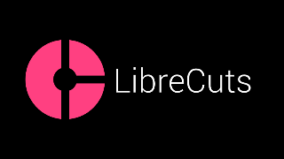

# LosslessCut Android

[](https://opensource.org/licenses/MIT)
[](https://android-arsenal.com/api?level=26)

**LosslessCut** is a high-performance, open-source Android application for **instant, lossless media trimming and merging**. By manipulating media containers directly, it preserves original quality and processes files at lightning speed without re-encoding.

<p align="center">
  
</p>

## ✨ Features

- 🚀 **Zero Quality Loss**: Trims and merges video (`.mp4`) and audio (`.m4a`) using native `MediaExtractor` and `MediaMuxer`—no transcoding involved.
- 🎞️ **Pro Timeline**: Desktop-class NLE timeline supporting multi-segment editing (Split, Discard, and Drag).
- 🔍 **Precision Seeking**: Zoom up to 20x for frame-accurate edits.
- 🧲 **Keyframe Snapping**: Haptic feedback and visual snapping to keyframes ensure cuts are perfectly aligned for lossless export.
- 📱 **Adaptive UI**: Ergonomic landscape sidebars and a unified floating player overlay for maximum screen real estate.
- ➕ **Smart Playlist**: Inline "Add Media" shortcut and intelligent duplicate detection on import.
- 🎵 **Audio-Only Mode**: Intelligent UI adaptation for audio files with waveform visualization.
- 📦 **Batch Export & Merge**: Export multiple "KEEP" regions as individual clips or merge them into a single seamless file in one pass.
- 🎼 **Smart Audio Extraction**: Automatically saves audio-only exports (when video is unchecked) as lossless `.m4a` files in the `Music` folder.
- ♿ **Accessibility First**: Comprehensive screen reader support via virtual view hierarchies (`ExploreByTouchHelper`).
- 🔄 **Non-Destructive Workflow**: Robust undo/redo stack for all segment operations.

## 🛠️ How it Works

Unlike traditional video editors that decode and re-encode every frame, LosslessCut operates at the **container level**:

1. **Probe**: Scans the file structure to identify stream metadata and track availability.
2. **Visualize**: Renders a zoomable timeline where keyframes are marked as snapping points.
3. **Mux**: During export, the app extracts the original encoded samples between cut points and remuxes them into a new container. If the video track is excluded, it smartly routes to an audio-only `.m4a` container to preserve original quality.

## 🚀 Getting Started

### Prerequisites
- Android Studio Koala+
- Android SDK 35 (Target) / 26 (Min)

### Development
```bash
# Clone the repo
git clone https://github.com/tazztone/lossless-video-cut.git

# Build debug APK
./gradlew assembleDebug
```

## 🔒 Permissions & Privacy
- **Privacy-First Model**: Removed all unnecessary runtime permissions (Notifications, Media Access). The app relies on the **Storage Access Framework (SAF)** for user-initiated file selection.
- **Scoped Storage**: Uses `MediaStore` to save results to `Movies/LosslessCut` (video) or `Music/LosslessCut` (audio extraction). 
- **Privacy**: 100% offline. No analytics, no tracking, no data collection.

## 🗺️ Roadmap
- [ ] **Smart Cut**: Re-encode only the tiny GOP (Group of Pictures) at cut points for true frame-accurate lossless editing.
- [ ] **AI Silence Detection**: Automatically identify and discard silent regions in audio/video.
- [ ] **Background Processing**: Move heavy muxing tasks to `WorkManager` for large file handling.

## 📄 License
Licensed under the **MIT License**. See [LICENSE](LICENSE) for details.
