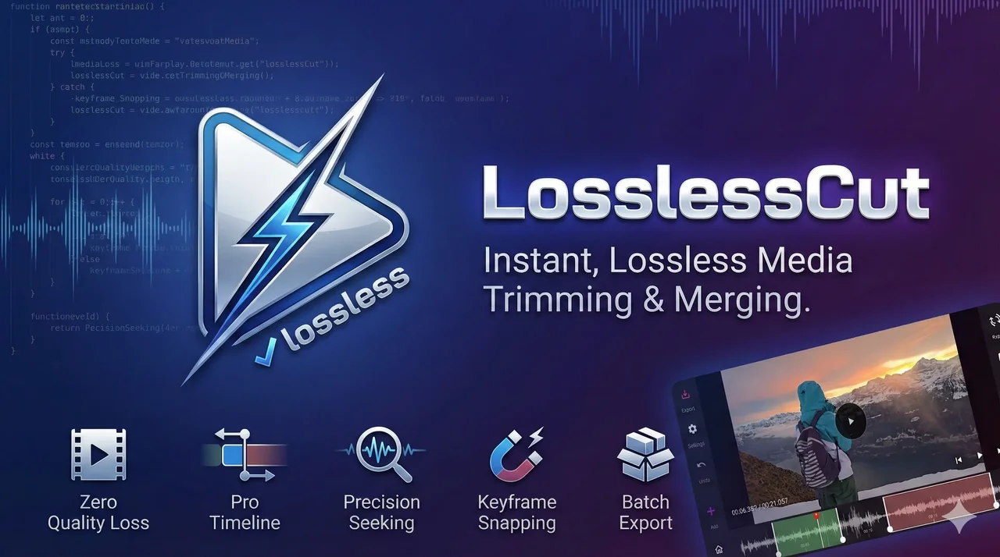
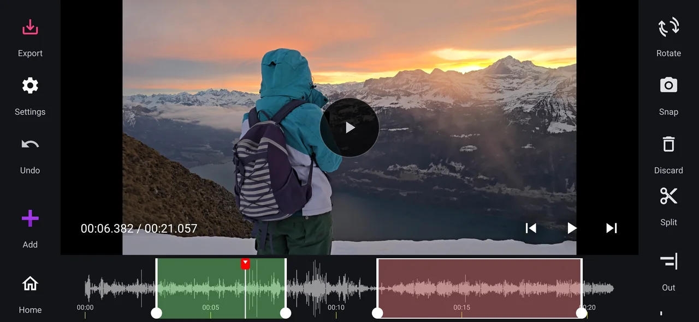
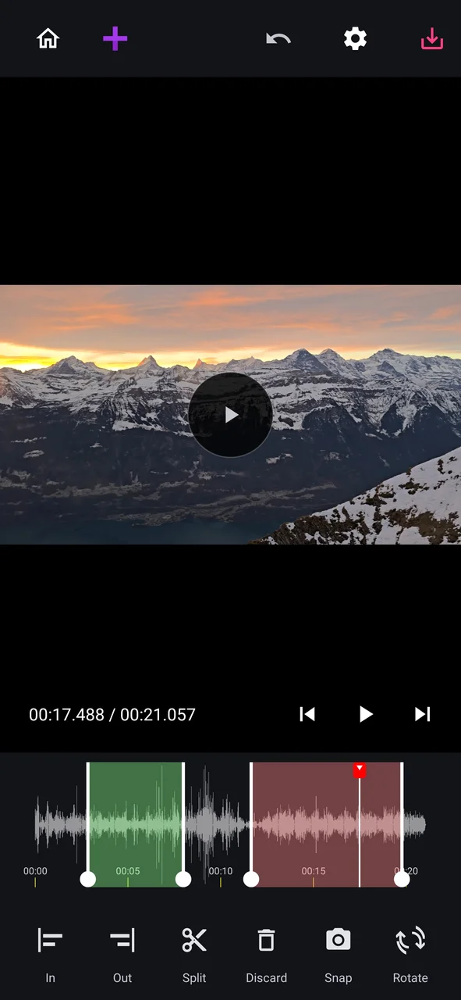

# LosslessCut (MP4)

[](https://opensource.org/licenses/MIT)
[](https://android-arsenal.com/api?level=26)

**LosslessCut (MP4)** is a high-performance, open-source Android application for **instant, lossless media trimming and merging** of MPEG-4 containers. By manipulating `.mp4` and `.m4a` files directly, it preserves original quality (H.264, H.265, AAC) and processes files at lightning speed without re-encoding.

<p align="center">
  
</p>

## ✨ Features

- 🚀 **Zero Quality Loss**: Trims and merges video (`.mp4`) and audio (`.m4a`) using native `MediaExtractor` and `MediaMuxer`—no transcoding involved.
- 🎞️ **Pro Timeline**: Desktop-class NLE timeline supporting multi-segment editing (Split, Discard, and Drag).
- 🔍 **Precision Seeking**: Zoom up to 20x for frame-accurate edits.
- 🧲 **Keyframe Snapping**: Mandatory, strict keyframe snapping in lossless mode ensures frame-perfect cuts. Features haptic feedback and visual snapping.
- 📱 **Adaptive UI**: Ergonomic landscape sidebars and a unified floating player overlay for maximum screen real estate.
- ➕ **Smart Playlist**: Inline "Add Media" shortcut and intelligent duplicate detection on import.
- 🎵 **Audio-Only Mode**: Intelligent UI adaptation for audio files with waveform visualization.
- 📦 **Batch Export & Merge**: Export multiple "KEEP" regions as individual clips or merge them into a single seamless file in one pass.
- 🎼 **Smart Audio Extraction**: Automatically saves audio-only exports (when video is unchecked) as lossless `.m4a` files in the `Music` folder.
- ♿ **Accessibility First**: Comprehensive screen reader support via virtual view hierarchies (`ExploreByTouchHelper`).
- 🔄 **Non-Destructive Workflow**: Full **Undo/Redo** stack for all segment operations.
- 🔇 **Smart Silence Detection**: Automated, parameterized removal of quiet sections with interactive "Ghost State" visualizations, live savings previews, and intuitive threshold adjustments.
- ⏸️ **Intelligent Focus**: **Auto-pause** playback when opening settings, export options, or silence detection to prevent missing content.
- ✨ **Contextual UX**: Seamless, auto-dismissing timeline hints and haptic feedback for a clean, professional interface.
- 💾 **Project Persistence**: Seamless session restoration—resume your edits exactly where you left off.
- 📂 **Custom Output Path**: Flexible export folder selection via Storage Access Framework (SAF).
- 🔄 **Remux & Convert**: Change container formats (e.g., MKV to MP4) instantly without re-encoding.
- 🏷️ **Quick Metadata Fix**: Correct video orientation and rotation flags in seconds.
- 🏗️ **Clean Architecture**: Context-free ViewModels and a centralized Repository pattern for maximum maintainability.
- 🧊 **Format Compatibility**: Optimized for modern codecs and containers (MP4, AAC). See [Technical Reference](#7-format-compatibility) for details.

## 📸 Screenshots

<p align="center">
  
  
</p>

## 🛠️ How it Works

Unlike traditional video editors that decode and re-encode every frame, LosslessCut operates at the **container level**:

1. **Probe**: Scans the file structure to identify stream metadata and track availability.
2. **Visualize**: Renders a zoomable timeline where keyframes are marked as snapping points.
3. **Mux**: During export, the app extracts the original encoded samples between cut points and remuxes them into a new container. If the video track is excluded, it smartly routes to an audio-only `.m4a` container to preserve original quality.

## 🚀 Getting Started

### Prerequisites
- Android Studio Koala+
- Android SDK 35 (Target) / 26 (Min)

### Development
```bash
# Clone the repo
git clone https://github.com/tazztone/lossless-video-cut.git

# Generate icons (Consolidated tool)
java dev-scripts/asset-generate-icons.java

# Build debug APK using Gradle Kotlin DSL
./gradlew assembleDebug
```

## 🤝 Contributing

We follow **MVVM + Clean Architecture** with a strict separation between UI, Domain, and Data layers.

- **Multi-Module**: Core logic belongs in `:core:domain`, `:core:data`, or `:engine`.
- **Use Cases**: All business logic MUST reside in Use Cases within the `:core:domain` module.
- **Workflow**: Create a feature branch for every change and ensure CI passes before opening a PR.
- **Code Style**: Follow standard Kotlin conventions and avoid "God Classes".

## 🛡️ Security Policy

### Reporting a Vulnerability

If you discover a security vulnerability within LosslessCut, please do not open a public issue. Instead, report it privately to the maintainers. We aim to respond to all reports within 48 hours and provide a fix or mitigation plan as soon as possible.

## 🔒 Permissions & Privacy
- **Privacy-First Model**: Removed all unnecessary runtime permissions (Notifications, Media Access). The app relies on the **Storage Access Framework (SAF)** for user-initiated file selection.
- **Scoped Storage**: Uses `MediaStore` to save results to `Movies/LosslessCut` (video) or `Music/LosslessCut` (audio extraction). 
- **Privacy**: 100% offline. No analytics, no tracking, no data collection.

## 🗺️ Roadmap

- [ ] ~~**Smart Cut (v2.0)**~~ (Shelved: Native lossless cutting is sufficiently fast)
- [ ] **AI Tools**: Integration of on-device ML for automatic scene change detection.
- [ ] ~~**Task Orchestration**~~ (Shelved: Background orchestration not required for near-instant exports)
- [ ] **Advanced Tags**: Title, artist, and creation date editing.
- [ ] **Architectural Enforcement**: Implement Konsist testing to safeguard module boundaries in the CI pipeline.
- [x] **Domain Purification**: Extracted standard JVM domain module for maximum portability and testability.
- [x] **Metadata Tuning**: Quick rotation and orientation flag fixes.
- [x] **Remux Utility**: Instant container switching.
- [x] **Activity Decomposition**: Refactored major UI logic into specialized delegates.
- [x] **Modern Build**: Full migration to Gradle Kotlin DSL and AGP 9.0.

## 🛠️ Technical Reference

### 1. System Architecture
LosslessCut follows **MVVM** architecture with a focus on reactive UI and native media processing.

#### Tech Stack
- **Languages**: Kotlin 1.9+, Gradle Kotlin DSL (`.gradle.kts`)
- **Media Engine**: `MediaExtractor`, `MediaMuxer` (Processing), Media3 (Playback UI in `:app`)
- **Dependency Inversion**: Clean boundaries via `:core:domain` interfaces (JSR-330)
- **Dependency Injection**: Hilt (in Android modules)
- **Minimum SDK**: 26 (Android 8.0)
- **Target SDK**: 36 (Android 15)
- **Tooling**: AGP 9.0 (Built-in Kotlin Support), JVM 17 Toolchain

### 2. Project Structure
The project is organized into a modular feature/layer-based structure:
- **`:app`**: Main Android application module.
  - **`ui`**: Fragments (`EditorFragment`, `RemuxFragment`, `MetadataFragment`) and Navigation. `VideoEditingActivity` is now a thin host.
  - **`viewmodel`**: Jetpack ViewModels. `VideoEditingViewModel` delegates complex logic to Use Cases.
  - **`:core:domain`**: Pure Kotlin/JVM library. Contains Use Cases and domain interfaces. Zero Android/Hilt dependencies.
- **`:engine`**: Core media processing library. Decoupled from storage and Media3 via domain interfaces.
- **`:core:data`**: Shared data module containing models (`MediaClip`, `TrimSegment`), persistence (`AppPreferences`), and implementations of domain interfaces (`IMediaFinalizer`).

### 3. Component Blueprint

#### UI & Navigation
- **Jetpack Navigation**: Orchestrates transitions between editing modes.
- **Fragments**:
  - `EditorFragment`: Full NLE editor.
  - `RemuxFragment`: Simplified remux-only mode.
  - `MetadataFragment`: Metadata editing and rotation override.
- **CustomVideoSeeker**: A high-performance custom `View` for the NLE timeline.
    - **Logic**: Handles multi-touch (zoom), drag gestures for playhead and segments, and edge-auto-panning.
    - **Accessibility**: Implements `ExploreByTouchHelper` to expose virtual nodes for playhead and segment handles. Supports standard accessibility actions.
    - **UX Polish**: Implements auto-dismissing hint animations (e.g., "pinch to zoom") that disappear upon the first interaction.
    - **Visuals**: Draws segment colors, keyframe ticks, and zoom levels directly on the canvas for performance.
- **Layout System**: Uses orientation-specific layouts (`layout` vs `layout-land`) to maintain ergonomics. 
    - **Playlist Sidebar**: Synced with ExoPlayer via robust **Clip ID-based targeting**. Blue border follows the Clip UUID, making it position-invariant.
    - **Overlays**: Semi-transparent overlays for player controls ensure unified UX across both orientations. **Auto-pauses** playback whenever a dialog or overlay (Settings, Silence Cut, Export) is opened.

#### 3a. User Interaction Layer
- **Keyboard Shortcuts**: Managed by `ShortcutHandler`.
    - `SPACE`: Play/Pause.
    - `I` / `O`: Set In/Out markers.
    - `S`: Split segment at current playhead position.
    - `LEFT` / `RIGHT`: Seek to previous/next keyframe.
    - `ALT + LEFT/RIGHT`: Nudge playhead via `PlayerManager.performNudge`.
- **Share Intent Flow**: `MainActivity` filters for `ACTION_SEND`/`ACTION_VIEW`. URIs are passed to `VideoEditingActivity` for probing.
- **Playback Speed**: Range: `0.25x, 0.5x, 1.0x, 1.5x, 2.0x, 4.0x`.

#### Data & Domain Logic
- **`LosslessEngine`**: Core muxing orchestration.
    - `executeLosslessCut`: Trims a single file. Bypasses video-specific orientation hints if no video track is present.
    - `executeLosslessMerge`: Concatenates multiple `MediaClip` objects or segments. Handles PTS shifting.
- **`VideoEditingViewModel`**: State machine for the editor. **Context-Free**.
    - **Architecture**: No dependency on `android.content.Context`. All context-dependent operations (I/O) are delegated to the Repository.
    - **Events**: Uses a `VideoEditingEvent` sealed class via `Channel` for reliable one-time UI actions (e.g., `ShowToast`, `ExportComplete`).
    - **Undo/Redo Stack**: In-memory history of `List<MediaClip>` snapshots with synchronized `canRedo` flow logic.
    - **Silence Detection**: Orchestrates `DetectionUtils.findSilence` using extracted `waveformData`.

#### Utilities
- **StorageUtils**: Handles Scoped Storage. Centralizes URI creation, dynamically selecting `Movies/LosslessCut` or `Music/LosslessCut` based on media type.
- **TimeUtils**: Formatting and precision conversion between MS and microseconds.
- **Permission Management**: Relies primarily on the **Storage Access Framework (SAF)**. Broad runtime permissions are avoided for enhanced privacy and UX.

### 4. Key Workflows

#### Lossless Export Process
1. `MediaExtractor` seeks to the nearest keyframe *before* the requested `startMs`.
2. Encoded samples are read and passed to `MediaMuxer`.
3. Samples *before* `startMs` are discarded by the muxer logic based on timestamp.
4. Samples are written until `endMs`.

#### Multi-Clip Merging
- Validates track compatibility (codecs must match for lossless concatenation).
- Shifts sample PTS values by the cumulative duration of previous segments to ensure continuity.

### 5. Development & CI
- **Testing**: 
    - JVM: `./gradlew test` (Robolectric).
    - Android: `./gradlew connectedAndroidTest` (Espresso).
- **Scripts**: `dev-scripts/` contains `IconGenerator.java` and maintenance scripts like `project-clean.sh`.
- **CI/CD**: GitHub Actions (`release.yml`) builds and signs production APKs on tag push. Includes a **Lint gate** and static analysis with **Detekt**.

### 6. Context7 Library IDs
Use these IDs for documentation queries:
- `/androidx/media` (Media3/ExoPlayer)
- `/kotlin/kotlinx.coroutines` (Concurrency)
- `/androidx/datastore` (Preferences)
- `/material-components/material-components-android` (UI)

### 7. Format Compatibility
LosslessCut is optimized for modern media containers and codecs supported by the Android [MediaMuxer](https://developer.android.com/reference/android/media/MediaMuxer) and [MediaExtractor](https://developer.android.com/reference/android/media/MediaExtractor).

| Feature | Supported | Notes |
| :--- | :--- | :--- |
| **Containers** | `.mp4`, `.m4a` | Standard MPEG-4 containers. |
| **Video Codecs** | H.264 (AVC), H.265 (HEVC) | Standard bitrates; depends on device hardware decoder limits. |
| **Audio Codecs** | AAC (LC, HE-AAC) | Primary audio format for MP4/M4A remuxing. |
| **MP3 Support** | ❌ (Remux) / ✅ (Play) | MP3 tracks cannot be losslessly remuxed into MP4 containers via `MediaMuxer` without transcoding. |
| **MKV/WebM** | ✅ (Remux ONLY) | Can remux MKV to MP4 if the internal tracks are compatible (H.264/AAC). |

> [!NOTE]
> LosslessCut focuses on **remuxing**, not transcoding. If the input codec is incompatible with the MPEG-4 container (like MP3 or Vorbis), the muxer will reject the track to avoid quality loss via silent corruption.

## 📄 License
Licensed under the **MIT License**. See [LICENSE](LICENSE) for details.
