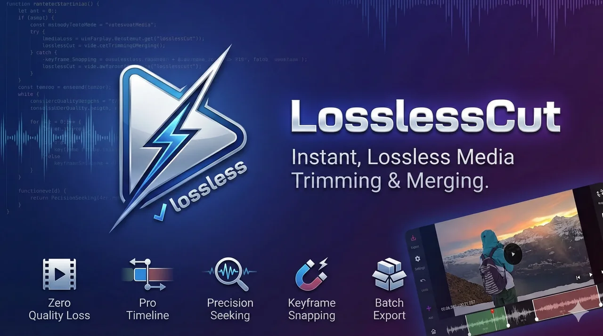
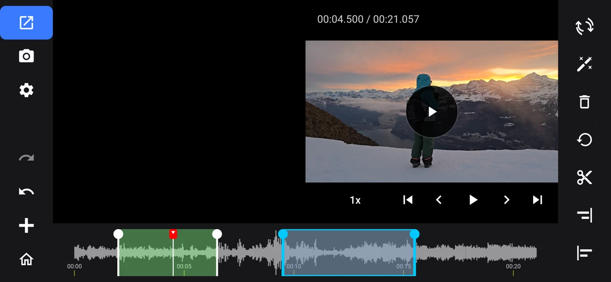
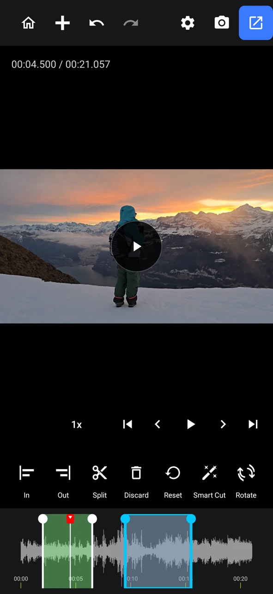
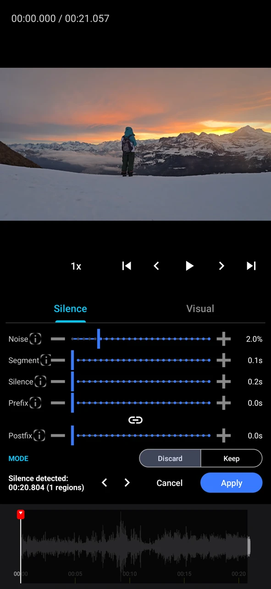
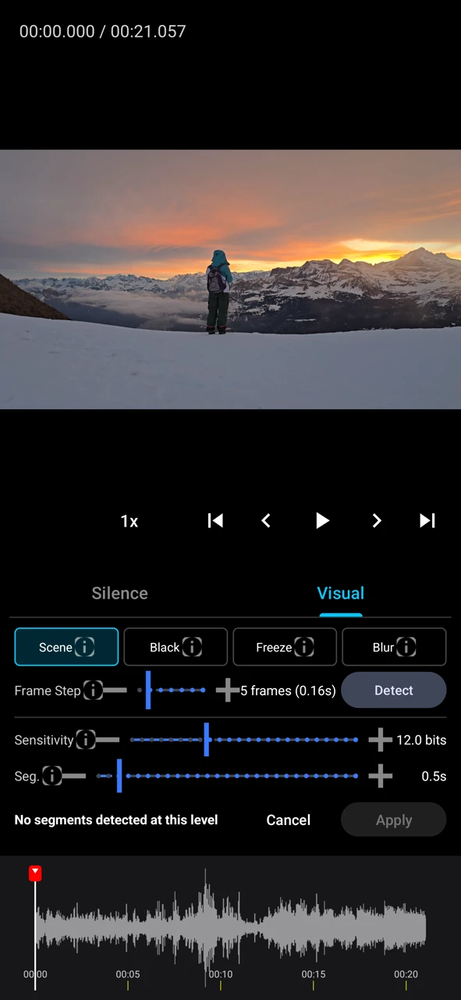
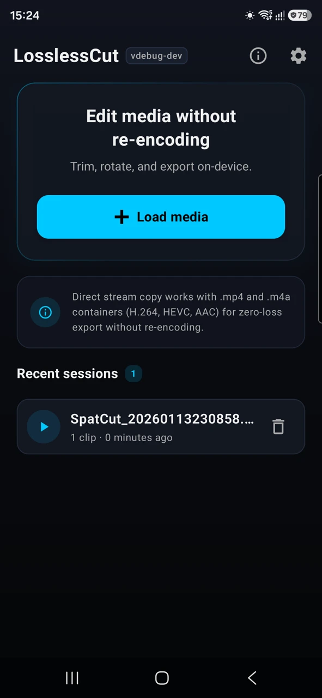
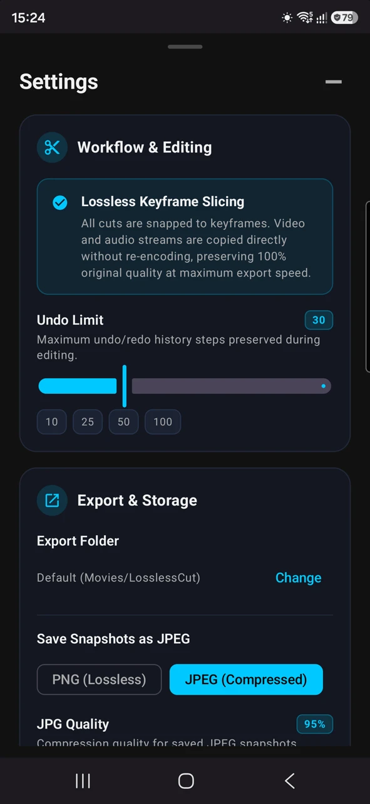

# LosslessCut (MP4)

[](https://opensource.org/licenses/MIT)
[](https://android-arsenal.com/api?level=29)

**LosslessCut (MP4)** is a high-performance, open-source Android application for **instant, lossless media trimming and merging**. By manipulating compatible codecs (**H.264, H.265, AAC**) directly, it preserves original quality and processes files at lightning speed, remuxing them into standard `.mp4` and `.m4a` containers without re-encoding.

<p align="center">
  
</p>

## ✨ Key Feature Pillars

### ⚡ Zero-Loss Direct Bitstream Engine
- 🚀 **Direct Muxing**: Trims and merges video (`.mp4`) and audio (`.m4a`) using native `MediaExtractor` and `MediaMuxer` with zero transcoding.
- 📦 **Batch Export & Merge**: Export multiple "KEEP" regions as individual clips or merge them into a single seamless file in one pass.
- 📤 **Direct Media Sharing**: Instantly share exported video or audio clips to other apps, play them directly, or return home right from the post-export completion sheet.
- 🎼 **Smart Audio Extraction**: Automatically routes audio-only exports to lossless `.m4a` files in the `Music` folder.
- 🔄 **Rotation Metadata & Quick Fixes**: Apply orientation/rotation flag repairs without re-encoding.

### 🧰 Unified Editor Workflow
- 📥 **One Entry Point**: Load video or audio from the redesigned dashboard and use the same editor for trimming, splitting, rotation, and export.
- 🕘 **Recent Sessions**: Dirty editing sessions can be resumed from the dashboard while source access remains available through Android's Storage Access Framework.
- 🎛️ **Export media surface**: Choose combined or separate output, rotation metadata, and tracks from one full-screen modal.

### 🎞️ Pro NLE Timeline & Ergonomics
- 🔍 **Precision Timeline**: Zoom up to 20x for frame-accurate edits with mandatory keyframe snapping and haptic feedback.
- 🎯 **Frame-by-Frame Transport**: Single-frame step buttons (`◄ 1f`, `1f ►`) with drift-free exact frame rounding and keyboard shortcuts (`,`, `.`, `Shift + Arrow`).
- 🎵 **Multi-Track Audio Waveform**: Interactive `[A1 ▾]` badge to inspect stream metadata and toggle between audio waveforms and playback routing on multi-track media.
- 👆 **Anchored Actions**: Long-press inside a segment to split or delete at the touch location; non-destructive Undo/Redo history stack.
- 📱 **Adaptive Layout**: Responsive landscape sidebar, floating player overlay, and audio waveform display.
- ♿ **Accessibility First**: Full screen-reader support via `ExploreByTouchHelper` virtual view hierarchies.

### 🤖 Smart Cut (v2.0) Automated Detection
- 🔇 **Silence Cut**: Automated detection and removal of quiet sections with interactive ghost state preview and incremental +/- step slider controls.
- 👁️ **Visual Detection**: pHash, SAD luminance delta, and contrast-normalized Laplacian variance for Scene, Black, Freeze, and Blur detection.
- ⏭️ **Interactive Match Jumpers**: Prev/Next match navigation buttons to step the playhead directly through detected preview ranges on the timeline.
- 🔀 **Invert Keep/Discard**: Instantly toggle between removing or preserving detected ranges.

### 🔒 Privacy, SAF & Performance Cache
- 📂 **Scoped Storage**: Storage Access Framework (SAF) tree output and MediaStore integration with zero unnecessary permissions.
- ⚡ **Analysis Cache**: App-private LRU cache for waveforms and visual analysis with configurable size caps and retention age.
- 🛡️ **100% Offline**: Zero analytics, zero data collection, zero network permissions.

## 📸 Screenshots

### Editor & Timeline
<p align="center">
  
  
</p>

### Smart Cut & Automation
<p align="center">
  
  
</p>

### Dashboard & Settings
<p align="center">
  
  
</p>

## 🛠️ How it Works

Unlike traditional video editors that decode and re-encode every frame, LosslessCut operates at the **container level**:

1. **Probe**: Scans file bitstreams to extract stream metadata, tracks, and sync keyframes.
2. **Visualize**: Renders a zoomable NLE timeline where keyframes act as mandatory snapping boundaries.
3. **Mux**: Writes original encoded sample buffers directly to the target output container.

## 🚀 Getting Started

### Using the app
1. Tap **Load media** and choose one or more compatible video or audio files.
2. Edit the loaded media in the timeline using trim, split, rotate, Smart Cut, and undo/redo actions.
3. Tap **Export** to choose combined or separate output, adjust rotation metadata, select tracks, and export the edited media.
4. Use the post-export completion sheet to directly share the exported clip(s) with other apps, preview the media, or return to the dashboard.
5. Leave the editor with unsaved changes to keep a recent session card on the dashboard; completed exports and discarded sessions are removed from recents.

### Prerequisites
- **JDK 17 or 21**
- **Android SDK 36** (Target) / **29** (Min)
- **AGP 9.0+ / Gradle 9.2+**

### Development & Build
```bash
# Clone the repository
git clone https://github.com/tazztone/lossless-video-cut.git
cd lossless-video-cut

# Build debug APK
./gradlew assembleDebug

# Deploy and launch on connected device
./scripts/dev-scripts/adb-run-app.sh
```

### Downloads

Prebuilt APK and AAB artifacts are published with tagged releases on
[GitHub Releases](https://github.com/tazztone/lossless-video-cut/releases/latest).

## 🤝 Contributing

We follow **MVVM + Clean Architecture** with strict layer separation between UI, Domain, and Data modules.

- **Multi-Module**: Core logic belongs in `:core:domain`, `:core:data`, or `:engine`.
- **Use Cases**: All business logic MUST reside in Use Cases within `:core:domain`.
- **Verification**: Run `./scripts/dev-scripts/project-verify.sh` before submitting PRs; it also verifies the 80% minimum domain coverage threshold.

## 🛡️ Security Policy

If you discover a security vulnerability, please [report it privately](https://github.com/tazztone/lossless-video-cut/security/advisories/new) rather than opening a public issue. See [SECURITY.md](SECURITY.md).

## 🗺️ Roadmap

- [x] **Smart Cut (v2.0)**: Integrated visual detection (Scene, Black, Freeze, Blur) with Silence Cut.
- [x] **Architectural Enforcement**: Konsist tests safeguarding module boundaries.
- [x] **Domain Purification**: Standard pure JVM domain module (`:core:domain`).
- [x] **Modern Build**: Full migration to Gradle Kotlin DSL and AGP 9.0.
- [ ] **Advanced Tags**: Title, artist, and creation date editing (container-specific metadata writer).

## 📚 Documentation Index

For detailed technical specifications, architecture blueprints, domain model glossaries, and developer workflows:

- 🏗️ **[Architecture & Technical Reference](docs/architecture.md)**: System architecture, multi-module structure, component blueprints, reactive state flow, risk tiers, and format matrix.
- 📖 **[Domain Model & Glossary](CONTEXT.md)**: Ubiquitous domain language, aggregate boundaries (`EditingSession`), and smart cut entities.
- 🛠️ **[Contributing Guide](CONTRIBUTING.md)**: Development setup, script automation suite, CI verification pipeline, and GitHub Actions release secrets management (`gh cli`).
- ⚙️ **[Build Tooling Matrix](docs/build-tooling.md)**: Toolchain versions (AGP, Gradle, Kotlin, KSP), flags, and modernization roadmap.
- 🔒 **[Privacy Policy](docs/privacy.html)**: Storage Access Framework (SAF) privacy model.

## 📄 License
Licensed under the **MIT License**. See [LICENSE](LICENSE) for details.
