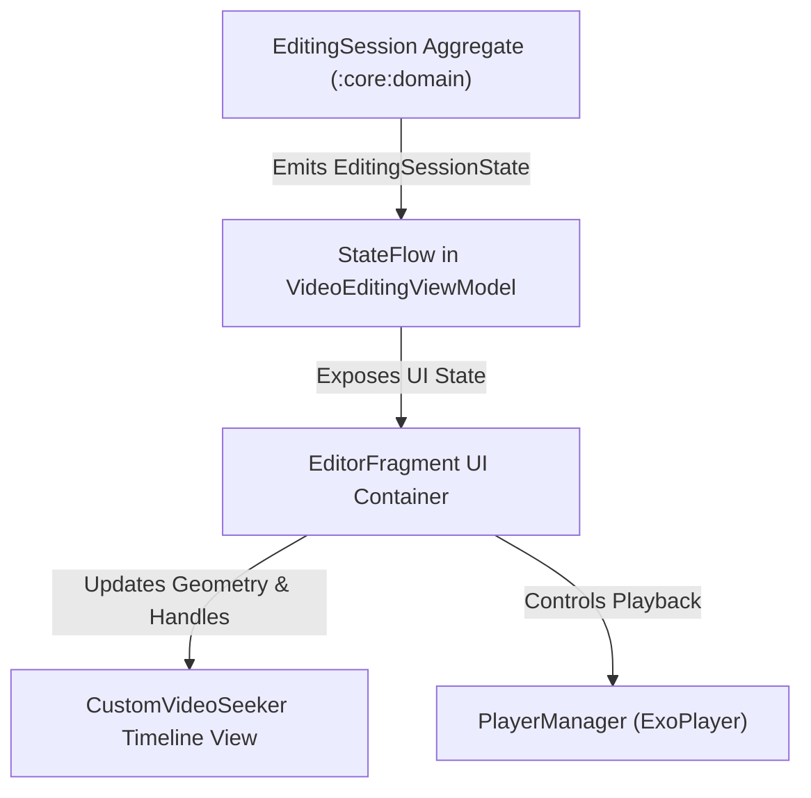
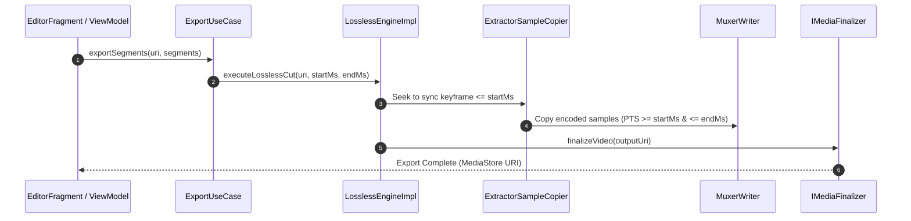
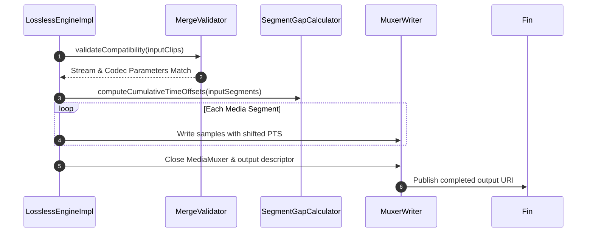

# LosslessCut Architecture & Technical Reference

This document provides a technical breakdown of the architecture, layer boundaries, module blueprint, key workflows, storage design, and format compatibility for LosslessCut (Android).

---

## 1. System Architecture

LosslessCut follows **MVVM + Clean Architecture** with strict layer boundaries, reactive state management via Kotlin Coroutines/Flows, and native Android media processing.

```
                          ┌───────────────────────────────────────────┐
                          │                   :app                    │
                          │   (UI, Fragments, Jetpack ViewModels)     │
                          └──────┬─────────────────────────────┬──────┘
                                 │                             │
                      runtimeOnly│                             │
                                 ▼                             ▼
                          ┌──────────────┐             ┌──────────────┐
                          │   :engine    │             │  :core:data  │
                          │(Media Engine)│             │(Repositories)│
                          └──────┬───────┘             └──────┬───────┘
                                 │                            │
                                 └──────────────┬─────────────┘
                                                │
                                                ▼
                          ┌───────────────────────────────────────────┐
                          │               :core:domain                │
                          │ (Pure JVM Library: Use Cases & Models)    │
                          └───────────────────────────────────────────┘
```

### Technology Stack
- **Languages**: Kotlin 2.2+, Gradle Kotlin DSL (`.gradle.kts`)
- **Media Processing**: Native `MediaExtractor`, `MediaMuxer` (in `:engine`), Media3 / ExoPlayer (Playback UI in `:app`)
- **Dependency Inversion & Injection**: Domain-level interfaces (`ILosslessEngine`, `IVideoEditingRepository`, `IMediaFinalizer`) resolved via Hilt (`:app`, `:engine`, `:core:data`)
- **SDK Targets**: Min SDK 26 (Android 8.0), Target SDK 36 (Android 15 / "Baklava")
- **Build System**: AGP 9.0+, JDK 17/21 Toolchain
- **Native Threading**: All `MediaExtractor`, `MediaCodec`, and `MediaMuxer` work is serialized through a dedicated single-threaded engine dispatcher to avoid unsafe concurrent native calls.

---

## 2. Architectural Guardrails & Layer Boundaries

To prevent technical debt and maintain zero-loss performance, the following rules are enforced across the codebase:

> [!IMPORTANT]
> 1. **Module Isolation**: `:app` includes `:engine` strictly via `runtimeOnly(:engine)`. Direct code imports of engine classes inside `:app` are forbidden; all invocation flows through Hilt and `:core:domain` interfaces (`ILosslessEngine`).
> 2. **Pure JVM Domain**: `:core:domain` must remain a pure JVM Kotlin library. Zero `android.*`, `androidx.*`, or Hilt dependencies allowed.
> 3. **Storage Access Policy**: Shared user media must be accessed exclusively through SAF (`DocumentFile`) or `ContentResolver` / `MediaStore`. Direct `java.io.File` access on external storage is strictly forbidden.
> 4. **UI Framework Scoping**: Jetpack Compose is restricted to `:app/ui/compose/**` for modular dialogs/sheets. NLE timeline scrubbing and video player UI rely on custom Android `View` components.

---

## 3. Project Structure & Module Breakdown

- **`:app`**: Android UI & presentation.
  - `ui/`: `MainActivity` dashboard, `EditorFragment`, recent-session UI, `PlayerManager`, and `ShortcutHandler`.
  - `customviews/`: Timeline scrubbing (`CustomVideoSeeker`, `TimelineViewport`, `SeekerRenderer`, `SeekerGhostRenderer`, `SeekerAccessibilityHelper`).
  - `ui/compose/`: Isolated Compose dialogs and sheets.
  - `viewmodel/`: `VideoEditingViewModel` orchestrating UI events and delegating state to `EditingSession`.
- **`:core:domain`**: Core business domain (Pure JVM).
  - `session/`: `EditingSession` domain aggregate managing segment boundaries, undo/redo stacks, and dirty state.
  - `model/`: `MediaClip`, `TrimSegment`, `FrameAnalysis`, `VisualDetectionConfig`, `WaveformResult`.
  - `usecase/`: `ExportUseCase`, `SilenceDetectionUseCase`, `SegmentDetectorUseCase`, `ClipManagementUseCase`, `SessionUseCase`, `ExtractSnapshotUseCase`.
  - `engine/` & `repository/`: Domain interfaces (`ILosslessEngine`, `IVideoEditingRepository`, `IMediaFinalizer`, `IVisualSegmentDetector`).
- **`:engine`**: Native media extraction & muxing engine.
  - `muxing/`: Deep pipeline (`MuxingPipeline`, `ExtractorSampleCopier`, `MuxerWriter`, `MergeValidator`, `SegmentGapCalculator`, `TrackInspector`, `SampleTimeMapper`).
  - `VisualAlgorithms.kt` & `VisualSegmentDetectorImpl.kt`: Frame pHash, SAD, and Laplacian variance analysis.
  - `AudioWaveformExtractor.kt` & `AudioDecoderImpl.kt`: Low-level PCM audio decoding and amplitude extraction.
- **`:core:data`**: Storage, repositories, and preferences.
  - `data/`: `VideoEditingRepositoryImpl`, `AnalysisCacheImpl`, `AppPreferences` (DataStore).
  - `AnalysisCacheImpl`: App-private, versioned binary cache for waveform and visual frame-analysis results with LRU size eviction and age-based expiry.
  - `utils/`: `StorageUtils` for SAF tree creation and MediaStore operations.
  - `di/`: `MediaFinalizerImpl` implementation of `IMediaFinalizer`.

---

## 4. Component Blueprint

### Custom Timeline Seeker (`CustomVideoSeeker`)
- **Performance**: Uses `LruCache` waveform bitmap tile caching (2048px tiles) to eliminate per-frame canvas line rendering during scrubbing.
- **Interactivity**: Multi-touch zoom (up to 20x), top-anchored segment edge drag handles (preventing system gesture navigation conflicts), playhead/segment edge drag gestures, auto-panning, split line preview, and anchored delete/split actions on long press. Long press resolves KEEP segments before the playhead target when the playhead overlaps a segment.
- **Accessibility**: Virtual view hierarchy via `ExploreByTouchHelper` (`SeekerAccessibilityHelper`).

### Smart Cut Detection Engine
- **Silence Detection**: Analyzes raw PCM amplitudes (`AudioWaveformExtractor`) to compute RMS energy levels without noise floor distortion.
- **Visual Detection**: Refactored to operate on **exact frame-step logic** (`sampleIntervalFrames`, e.g. every 1st, 2nd, 5th, 10th frame) instead of millisecond intervals. Uses `MediaExtractor` frame stepping (`decodedFrameIndex % sampleIntervalFrames == 0`) with Kotlin-native perceptual hashing (pHash), normalized Sum of Absolute Differences rate (Luminance Delta/sec), and **contrast-normalized Laplacian variance** ($\frac{\text{Laplacian Variance}}{(\text{Mean Luma}/255.0)^2 + 0.05}$) with area-average box downsampling to eliminate spatial aliasing noise. Freeze frame ranges feature automatic start-timestamp backdating to frame $t_{i-1}$ to eliminate sampling lag. Includes post-input-EOS timeout protection (`MAX_EOS_TIMEOUTS`) to prevent hardware decoder drain hangs.
- **Segment Application**: `SilenceDetectionUseCase.applyDetectionRanges()` intersects newly detected ranges with existing clip `TrimSegment` bounds to preserve prior user clip trims.
- **Coroutine Cancellation Contract**: All low-level `MediaCodec` and `MediaExtractor` loops enforce cooperative cancellation via `coroutineContext.ensureActive()` and rethrow `CancellationException` to guarantee immediate resource release upon cancellation.

### State Management & Navigation
- **`VideoEditingViewModel`**: Unidirectional data flow state machine emitting single-shot UI events via `Channel<VideoEditingEvent>` with undo/redo segment history stacks.
- **Keyboard Shortcuts (`ShortcutHandler`)**: Desktop/hardware keyboard controls (`SPACE` toggle play, `I`/`O` segment bounds with keyframe snapping and smart segment creation/adjustment, `S` split, `LEFT`/`RIGHT` keyframe seek).

### Unified launch and session lifecycle
- `MainActivity` exposes one **Load media** action. File opens, share intents, and recent-session cards all navigate to `VideoEditingActivity` with the editor as the only navigation destination.
- Dirty editing state is serialized to app-private cache storage when the editor stops. The dashboard maintains the five most recent sessions, validates source URI access before resume, and removes unavailable, discarded, or successfully exported sessions.
- Export choices are grouped in one full-screen `ExportOptionsDialogPresenter` surface: combined or separate output, inline rotation metadata, track selection, and optional post-export move to System Trash / SAF document deletion.



---

## 5. Storage Architecture & Media Finalization

LosslessCut writes output media directly to destination URIs without requiring full temp file copies on shared storage:

```
[Muxer Pipeline] ──> ParcelFileDescriptor / Temp Working File
                                 │
                                 ▼
                     [StorageUtils.createMediaOutputUri]
                                 │
                 ┌───────────────┴───────────────┐
                 ▼                               ▼
       [Custom SAF Tree URI]          [MediaStore Collection]
      (DocumentFile.createFile)       (IS_PENDING = 1 API 29+)
                 │                               │
                 └───────────────┬───────────────┘
                                 ▼
                       [IMediaFinalizer]
                    (Set IS_PENDING = 0)
```

- **SAF Fallback**: If a custom directory is selected in preferences, `StorageUtils` creates the output file via `DocumentFile.fromTreeUri()`.
- **MediaStore Lifecycle**: On Android 10+ (API 29+), output files in public MediaStore collections are marked `IS_PENDING = 1` during writing and updated to `0` upon completion.
- **Non-MediaStore URIs**: `MediaFinalizerImpl` catches `UnsupportedOperationException` when invoking `IS_PENDING = 0` on SAF or FileProvider URIs.
- **Finalization Order**: The muxer is stopped and released, and the output descriptor is closed, before `IMediaFinalizer` publishes the URI. Failed exports remove their incomplete output where the provider permits it.

### Analysis cache

Derived analysis data is separate from user media and is stored under the app's private `noBackupFilesDir/analysis_cache` directory. `IAnalysisCache` in `:core:domain` defines the platform-neutral contract; `AnalysisCacheImpl` in `:core:data` provides the Android file-backed implementation.

- Waveforms and visual frame analyses use versioned binary payloads and atomic replacement on write.
- Cache keys include the source URI, media metadata, and analysis parameters so a changed clip or configuration does not reuse stale results.
- Reads refresh access time. Expired entries are removed by age, then least-recently-used entries are removed until the configured byte cap is met.
- Settings persist the maximum size (50–1000 MiB) and retention age (1–90 days). Users can inspect current usage or clear all derived analysis data; clearing does not affect source media or editing sessions.

### Editing session persistence
Editing sessions are separate from source media and analysis data. `VideoEditingRepositoryImpl` stores serialized clip state and a small recency index under the app-private `noBackupFilesDir/editing_sessions`; source files remain user-owned SAF/`ContentResolver` URIs. The index is capped at five sessions and is treated as recoverable convenience state rather than a backup. A session is removed when the user discards it or an export completes, and stale entries are removed when their source URI is no longer readable. During development, the old cache-based location is intentionally not migrated.

---

## 6. Key Media Workflows

### Lossless Cut / Export Flow


### Multi-Clip Merging Flow


---

## 7. Testing Architecture & Harness Setup

- **Module Test Command**: `./scripts/dev-scripts/gradle-test.sh <module> <pattern>`
- **Project Verification**: `./scripts/dev-scripts/project-verify.sh` (Runs Detekt, JVM unit tests, Lint, and Kover sequentially to avoid generated-source races.)
- **Konsist Architectural Tests**: `ArchitectureTest.kt` automatically enforces all 4 architectural guardrails in CI (preventing `:engine` imports in `:app`, Android/Hilt imports in `:core:domain`, `java.io.File` for shared storage, and Compose in custom views).
- **Kover Code Coverage Targets**: Core domain aggregate `EditingSession` (98.3%) and media processing engine `MuxingPipeline` (93.8%) maintain coverage well above the repository >80% threshold.
- **Engine Instrumented Tests**: Engine tests relying on native Android codecs MUST reside in `:engine/src/androidTest` (not `:app`).
- **FileProvider Mocking**: Instrumented tests use local storage / mocked `FileProvider` authorities (`:engine:connectedDebugAndroidTest`).
- **TargetSdk 33+ Test Asset Staging**: TargetSdk 33+ instrumented tests requiring media assets copy files to `cacheDir` via `UiAutomation.executeShellCommand()`.

---

## 8. Format Compatibility Matrix

LosslessCut operates strictly at the **container & bitstream level** using Android native `MediaMuxer`:

| Category | Lossless Direct Support | Container Remuxing / Notes |
| :--- | :--- | :--- |
| **Output Containers** | `.mp4`, `.m4a` (audio-only) | Formats requiring transcoding (MP3, FLAC, VP9) are excluded to ensure zero loss. |
| **Video Codecs** | **H.264 (AVC)**, **H.265 (HEVC)** | H.263, MPEG-4 Visual supported where container allows. |
| **Audio Codecs** | **AAC (LC, HE)** | AMR-NB, AMR-WB supported natively. |
| **Input Containers** | `.mp4`, `.m4a`, `.mov`, `.mkv`* | \*Remuxable to MP4 without re-encoding if internal audio/video codecs match target limits. |

Rotation metadata is configured inline on the unified lossless export surface for the current MP4/M4A output path. Generic title, artist, and creation-date tag writing is not implemented yet; see the Advanced Tags roadmap item in `README.md`.

---

## 9. Operational Risk Tiers & Verification Matrix

In accordance with Agentic Engineering standards, all code modifications are classified into three operational risk tiers with mandatory verification gates:

| Risk Tier | Scope & Features | Required Verification Gates |
| :--- | :--- | :--- |
| **Low** | UI layouts, Compose sheets, strings, formatting, docs | Focused JVM unit tests, Detekt linting (`./scripts/dev-scripts/project-verify.sh`). |
| **Medium** | Smart Cut algorithms (Silence/Visual), `EditingSession` mutations, ViewModel logic | Module JVM tests (`SilenceCutUseCaseTest`, `SegmentDetectorTest`), cache retention tests. |
| **High / Critical** | Native Muxing pipeline (`:engine`), SAF storage (`StorageUtils`), remuxing, MediaStore finalization | Full `./scripts/dev-scripts/project-verify.sh`, SAF file write verification, single-thread `MediaMuxer` assertion. |

---

## 10. Context7 Documentation IDs

For external AI documentation lookups:
- `/androidx/media` (Media3 / ExoPlayer)
- `/kotlin/kotlinx.coroutines` (Coroutines & Flows)
- `/androidx/datastore` (Preferences DataStore)
- `/material-components/material-components-android` (Material 3 UI)
