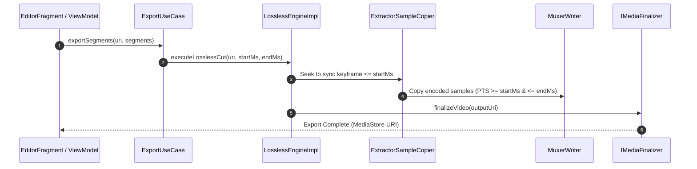
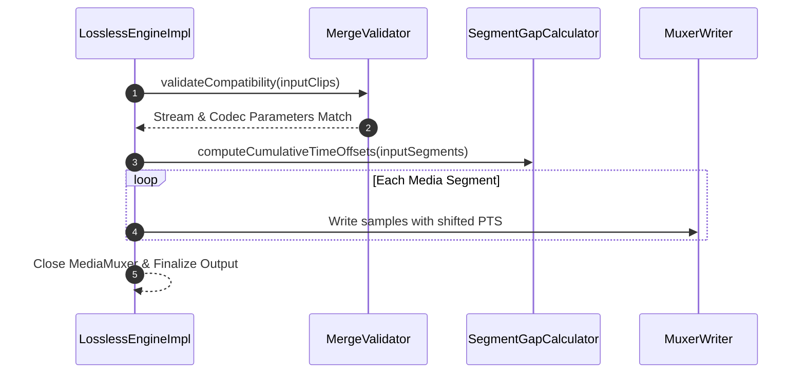

# LosslessCut Architecture & Technical Reference

This document provides a technical breakdown of the architecture, layer boundaries, module blueprint, key workflows, storage design, and format compatibility for LosslessCut (Android).

---

## 1. System Architecture

LosslessCut follows **MVVM + Clean Architecture** with strict layer boundaries, reactive state management via Kotlin Coroutines/Flows, and native Android media processing.

```
                          ┌───────────────────────────────────────────┐
                          │                   :app                    │
                          │   (UI, Fragments, Jetpack ViewModels)     │
                          └──────┬─────────────────────────────┬──────┘
                                 │                             │
                      runtimeOnly│                             │
                                 ▼                             ▼
                          ┌──────────────┐             ┌──────────────┐
                          │   :engine    │             │  :core:data  │
                          │(Media Engine)│             │(Repositories)│
                          └──────┬───────┘             └──────┬───────┘
                                 │                            │
                                 └──────────────┬─────────────┘
                                                │
                                                ▼
                          ┌───────────────────────────────────────────┐
                          │               :core:domain                │
                          │ (Pure JVM Library: Use Cases & Models)    │
                          └───────────────────────────────────────────┘
```

### Technology Stack
- **Languages**: Kotlin 2.2+, Gradle Kotlin DSL (`.gradle.kts`)
- **Media Processing**: Native `MediaExtractor`, `MediaMuxer` (in `:engine`), Media3 / ExoPlayer (Playback UI in `:app`)
- **Dependency Inversion & Injection**: Domain-level interfaces (`ILosslessEngine`, `IVideoEditingRepository`, `IMediaFinalizer`) resolved via Hilt (`:app`, `:engine`, `:core:data`)
- **SDK Targets**: Min SDK 26 (Android 8.0), Target SDK 36 (Android 15 / "Baklava")
- **Build System**: AGP 9.0+, JDK 17/21 Toolchain

---

## 2. Architectural Guardrails & Layer Boundaries

To prevent technical debt and maintain zero-loss performance, the following rules are enforced across the codebase:

> [!IMPORTANT]
> 1. **Module Isolation**: `:app` includes `:engine` strictly via `runtimeOnly(:engine)`. Direct code imports of engine classes inside `:app` are forbidden; all invocation flows through Hilt and `:core:domain` interfaces (`ILosslessEngine`).
> 2. **Pure JVM Domain**: `:core:domain` must remain a pure JVM Kotlin library. Zero `android.*`, `androidx.*`, or Hilt dependencies allowed.
> 3. **Storage Access Policy**: Shared user media must be accessed exclusively through SAF (`DocumentFile`) or `ContentResolver` / `MediaStore`. Direct `java.io.File` access on external storage is strictly forbidden.
> 4. **UI Framework Scoping**: Jetpack Compose is restricted to `:app/ui/compose/**` for modular dialogs/sheets. NLE timeline scrubbing and video player UI rely on custom Android `View` components.

---

## 3. Project Structure & Module Breakdown

- **`:app`**: Android UI & presentation.
  - `ui/`: Fragments (`EditorFragment`, `RemuxFragment`, `MetadataFragment`), `PlayerManager`, `ShortcutHandler`.
  - `customviews/`: Timeline scrubbing (`CustomVideoSeeker`, `TimelineViewport`, `SeekerRenderer`, `SeekerGhostRenderer`, `SeekerAccessibilityHelper`).
  - `ui/compose/`: Isolated Compose dialogs and sheets.
  - `viewmodel/`: `VideoEditingViewModel` orchestrating UI events and delegating state to `EditingSession`.
- **`:core:domain`**: Core business domain (Pure JVM).
  - `session/`: `EditingSession` domain aggregate managing segment boundaries, undo/redo stacks, and dirty state.
  - `model/`: `MediaClip`, `TrimSegment`, `FrameAnalysis`, `VisualDetectionConfig`, `WaveformResult`.
  - `usecase/`: `ExportUseCase`, `SilenceDetectionUseCase`, `SegmentDetectorUseCase`, `ClipManagementUseCase`, `SessionUseCase`, `ExtractSnapshotUseCase`.
  - `engine/` & `repository/`: Domain interfaces (`ILosslessEngine`, `IVideoEditingRepository`, `IMediaFinalizer`, `IVisualSegmentDetector`).
- **`:engine`**: Native media extraction & muxing engine.
  - `muxing/`: Deep pipeline (`MuxingPipeline`, `ExtractorSampleCopier`, `MuxerWriter`, `MergeValidator`, `SegmentGapCalculator`, `TrackInspector`, `SampleTimeMapper`).
  - `VisualAlgorithms.kt` & `VisualSegmentDetectorImpl.kt`: Frame pHash, SAD, and Laplacian variance analysis.
  - `AudioWaveformExtractor.kt` & `AudioDecoderImpl.kt`: Low-level PCM audio decoding and amplitude extraction.
- **`:core:data`**: Storage, repositories, and preferences.
  - `data/`: `VideoEditingRepositoryImpl`, `AppPreferences` (DataStore).
  - `utils/`: `StorageUtils` for SAF tree creation and MediaStore operations.
  - `di/`: `MediaFinalizerImpl` implementation of `IMediaFinalizer`.

---

## 4. Component Blueprint

### Custom Timeline Seeker (`CustomVideoSeeker`)
- **Performance**: Uses `LruCache` waveform bitmap tile caching (2048px tiles) to eliminate per-frame canvas line rendering during scrubbing.
- **Interactivity**: Multi-touch zoom (up to 20x), playhead/segment edge drag gestures, auto-panning.
- **Accessibility**: Virtual view hierarchy via `ExploreByTouchHelper` (`SeekerAccessibilityHelper`).

### Smart Cut Detection Engine
- **Silence Detection**: Analyzes raw PCM amplitudes (`AudioWaveformExtractor`) to compute RMS energy levels without noise floor distortion.
- **Visual Detection**: Uses `MediaExtractor` frame stepping with Kotlin-native perceptual hashing (pHash), Sum of Absolute Differences (SAD), and Laplacian variance to flag scene cuts, black frames, freeze frames, and blur quality.

### State Management & Navigation
- **`VideoEditingViewModel`**: Unidirectional data flow state machine emitting single-shot UI events via `Channel<VideoEditingEvent>` with undo/redo segment history stacks.
- **Keyboard Shortcuts (`ShortcutHandler`)**: Desktop/hardware keyboard controls (`SPACE` toggle play, `I`/`O` segment bounds, `S` split, `LEFT`/`RIGHT` keyframe seek).

---

## 5. Storage Architecture & Media Finalization

LosslessCut writes output media directly to destination URIs without requiring full temp file copies on shared storage:

```
[Muxer Pipeline] ──> ParcelFileDescriptor / Temp Working File
                                 │
                                 ▼
                     [StorageUtils.createMediaOutputUri]
                                 │
                 ┌───────────────┴───────────────┐
                 ▼                               ▼
       [Custom SAF Tree URI]          [MediaStore Collection]
      (DocumentFile.createFile)       (IS_PENDING = 1 API 29+)
                 │                               │
                 └───────────────┬───────────────┘
                                 ▼
                       [IMediaFinalizer]
                    (Set IS_PENDING = 0)
```

- **SAF Fallback**: If a custom directory is selected in preferences, `StorageUtils` creates the output file via `DocumentFile.fromTreeUri()`.
- **MediaStore Lifecycle**: On Android 10+ (API 29+), output files in public MediaStore collections are marked `IS_PENDING = 1` during writing and updated to `0` upon completion.
- **Non-MediaStore URIs**: `MediaFinalizerImpl` catches `UnsupportedOperationException` when invoking `IS_PENDING = 0` on SAF or FileProvider URIs.

---

## 6. Key Media Workflows

### Lossless Cut / Export Flow


### Multi-Clip Merging Flow


---

## 7. Testing Architecture & Gotchas

- **Module Test Command**: `./scripts/dev-scripts/gradle-test.sh <module> <pattern>`
- **Project Verification**: `./scripts/dev-scripts/project-verify.sh` (Runs Detekt, Lint, JVM unit tests, and Kover).
- **Engine Instrumented Tests**: Engine tests relying on native Android codecs MUST reside in `:engine/src/androidTest` (not `:app`).
- **FileProvider Mocking**: Instrumented tests use local storage / mocked `FileProvider` authorities (`:engine:connectedDebugAndroidTest`).
- **Test Asset Staging**: TargetSdk 33+ instrumented tests copy media assets to `cacheDir` via `UiAutomation.executeShellCommand()`.

---

## 8. Format Compatibility Matrix

LosslessCut operates strictly at the **container & bitstream level** using Android native `MediaMuxer`:

| Category | Lossless Direct Support | Container Remuxing / Notes |
| :--- | :--- | :--- |
| **Output Containers** | `.mp4`, `.m4a` (audio-only) | Formats requiring transcoding (MP3, FLAC, VP9) are excluded to ensure zero loss. |
| **Video Codecs** | **H.264 (AVC)**, **H.265 (HEVC)** | H.263, MPEG-4 Visual supported where container allows. |
| **Audio Codecs** | **AAC (LC, HE)** | AMR-NB, AMR-WB supported natively. |
| **Input Containers** | `.mp4`, `.m4a`, `.mov`, `.mkv`* | \*Remuxable to MP4 without re-encoding if internal audio/video codecs match target limits. |

---

## 9. Context7 Documentation IDs

For external AI documentation lookups:
- `/androidx/media` (Media3 / ExoPlayer)
- `/kotlin/kotlinx.coroutines` (Coroutines & Flows)
- `/androidx/datastore` (Preferences DataStore)
- `/material-components/material-components-android` (Material 3 UI)
